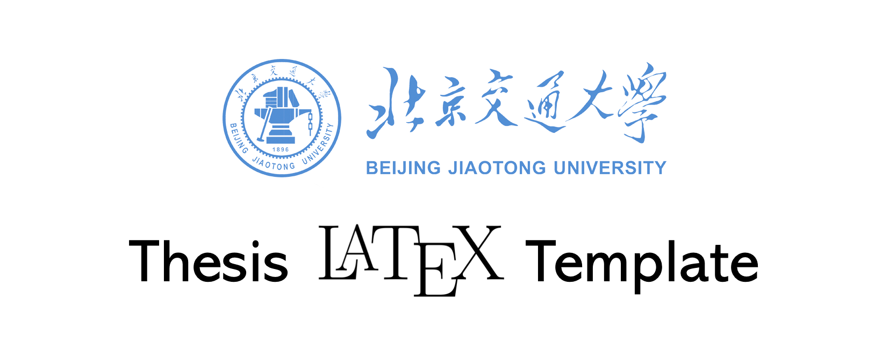
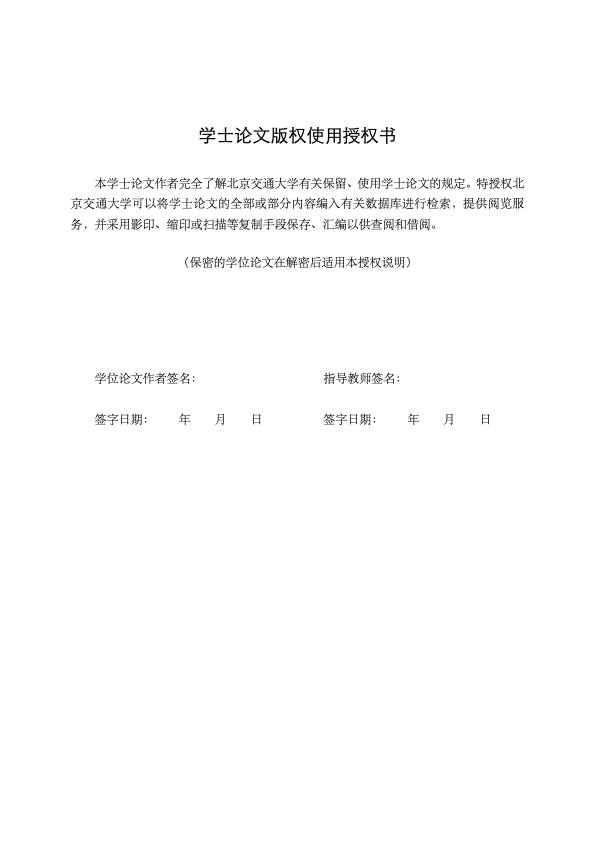
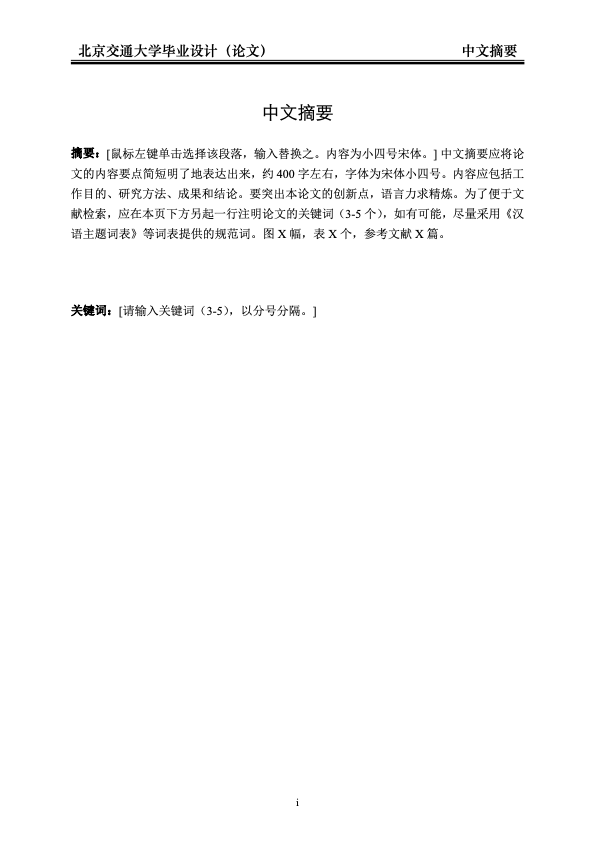
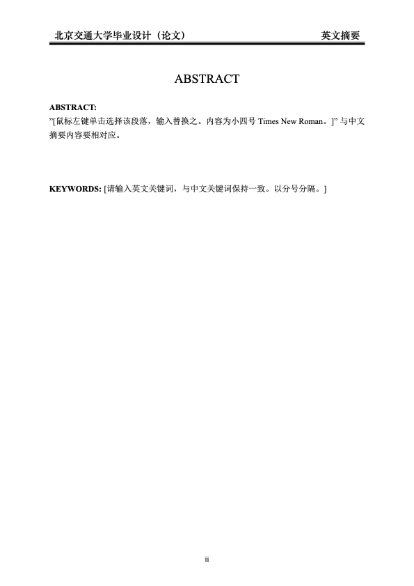
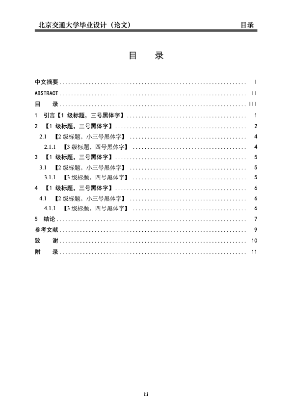
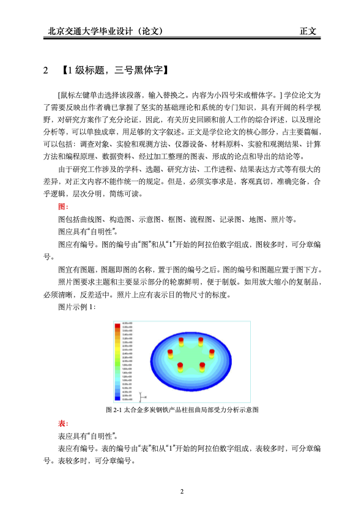
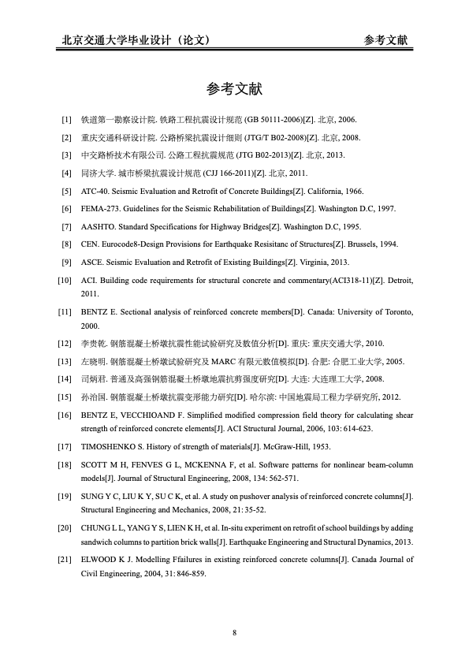
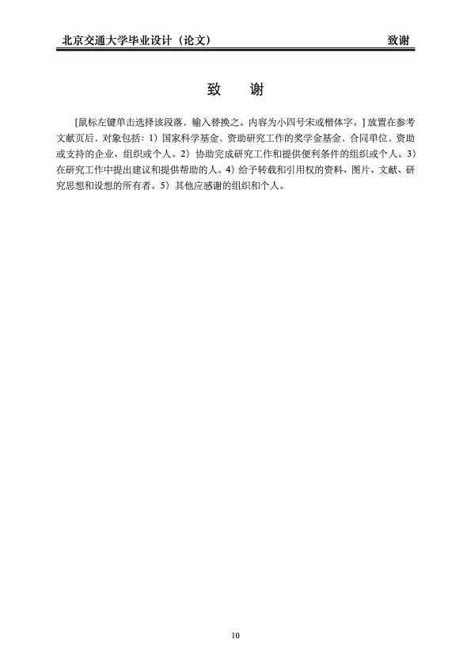
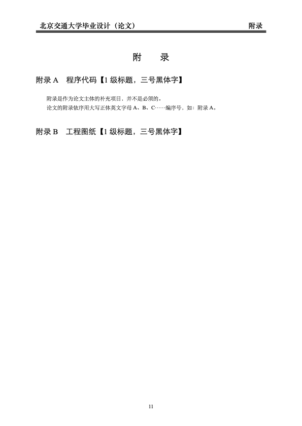
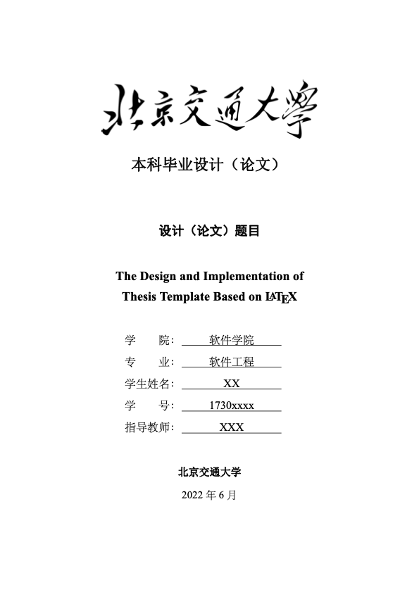

<h1 align="center" style="font-size: 16pt">
  
   
  北京交通大学本科毕业设计（论文）LaTeX 模板（非官方）
</h1>

Bachelor Thesis LaTeX Template for Beijing Jiaotong University

这是在北京交通大学本科生毕业设计（论文）规范下的一份 LaTeX 文档类型模板（非官方）。使用者无需修改导言区文档类型，直接在发布版的基础上，修改章节标题，撰写内容，即可完成毕业设计（论文）任务。

本 repo 基于开源库 <a href="https://github.com/paulzhn/bjtu-bachelor-thesis">paulzhn/bjtu-bachelor-thesis</a> 之上修改而成，在规范中明确格式和原工作的基础上，进一步还原了 word 模板样式，并对文件结构和命令、环境等进行了调整。

## 📑 使用说明

1. 下载这个项目的 zip 包到到本地
2. 直接对 chapters 文件下的 tex 文件进行修改，对应的摘要、章节内容、附录文件均已经默认生成，在此基础上加以修改即可
3. 替换 reference/bjtu-bachelor-thesis-reference.bib 内容为论文需要的 bibtex 参考文献
4. 请使用XeLaTeX编译
5. *make samplebib & Enjoy*

## 📁 文件结构

  
BJTU-Bachelor-Thesis

    

        
bjtu-bachelor-thesis

- chapters 正文各章节 tex 文件
- figures 论文插图
- reference 参考文献
- vi 视觉识别/校徽
- font 字体文件
- word word 模板
- bjtu-bachelor-thesis.cls 样式模板
- main.tex
- main.pdf
    

    

        
example

使用示例，包括多图排列、表格跨页等
    

    

        
sample

论文排版样例
    

|       |                   展示                   |                       展示                        |
  |:--------------------------------------:|:-----------------------------------------------:| :-----------------------------------------------: |
  | 预览  |     |  |
  | 说明  |                  封面页                   |                       授权页                       |
  | 文件  |              `\makecover`              |              `\makeAuthorization`               |
  | 预览  |  |         |
  | 说明  |                  中文摘要                  |                      英文摘要                       |
  | 文件  |             `abstract.tex`             |              `englishabstract.tex`              |
  | 预览  |    |               |
  | 说明  |                   目录                   |                     正文（部分）                      |
  | 文件  |           `\tableofcontents`           |                   `chapters/`                   |
  | 预览  |      |          |
  | 说明  |                  参考文献                  |                       致谢                        |
  | 文件  |  `bjtu-bachelor-thesis-reference.bib`  |                  `thanks.tex`                   |
  | 预览  |         |                   |
  | 说明  |                   附录                   |                     论文模板预览                      |
  | 文件  |             `appendix.tex`             |                   `main.pdf`                    |

## ⚠️ 使用建议

慎用 LaTeX 对本科论文进行排版，虽然 LaTeX 和 Word 相比更容易进行样式管理，但在官方模板发布之前，所有非官方的模板都仅供参考和二次开发。此外， Word 编写的论文更便于指导老师进行批注和修改，且为北京交通大学本科生毕业设计（论文）规范中的要求。